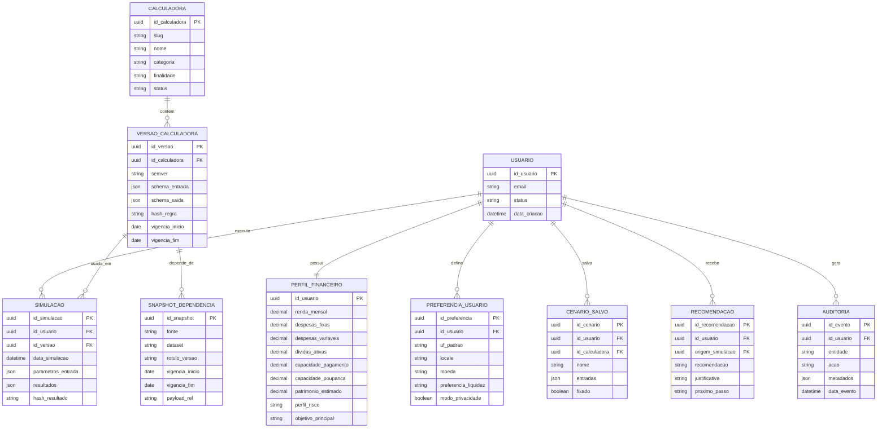

# Ecossistema integrado de calculadoras financeiras para crédito e investimentos

## Sumário executivo

A pesquisa-base desta conversa mostra que o ecossistema público de calculadoras de entity["organization","R7","brazil media company"], concentrado em entity["organization","Investidor Sardinha","financial education platform"], já contém massa crítica suficiente para ser tratado não como um conjunto de páginas isoladas, mas como o embrião de uma plataforma de decisão financeira. O hub público informa que as calculadoras são gratuitas mediante cadastro, declara atualização regular com taxas, alíquotas e legislações recentes e posiciona cada ferramenta como apoio a um objetivo financeiro específico. As páginas públicas mais robustas hoje se concentram em acumulação patrimonial, comparação de renda fixa, reserva de emergência, parcelamento e decisão de compra. citeturn2search0turn0search0turn0search1turn1search1turn1search2turn2search9

A grande tese se sustenta bem com o inventário disponível: uma simulação de reserva de emergência captura gastos mensais; uma simulação de compra à vista versus parcelado captura taxa de oportunidade e preferência temporal; uma simulação de Pix parcelado revela apetite por crédito de curto prazo; e simuladores como juros compostos, primeiro milhão, aposentadoria e renda revelam horizonte, disciplina de aporte e objetivo patrimonial. Quando esses dados são reutilizados, o produto deixa de “calcular páginas” e passa a construir um perfil financeiro único, capaz de recomendar a próxima melhor ação: reduzir dívida, ganhar liquidez, migrar para renda fixa mais eficiente ou acelerar aportes de longo prazo. citeturn0search0turn2search2turn1search0turn2search4turn1search1turn1search2turn2search9

O ponto mais importante da pesquisa, porém, não é apenas o inventário. É a assimetria entre os blocos. O núcleo de investimentos está relativamente bem servido: juros compostos, comparador de renda fixa, poupança x Selic, primeiro milhão, aposentadoria, renda e reserva de emergência têm propósito claro, entradas compreensíveis e resultados úteis. Já o núcleo de crédito aparece como mais estreito: a pesquisa encontrou comparadores e simuladores de parcelamento e decisão de uso do dinheiro, mas **não identificou na pesquisa-base** páginas dedicadas, com o mesmo grau de detalhe, para CET, empréstimo pessoal tradicional, portabilidade, refinanciamento ou consignado. Isso muda a priorização: o produto integrado deve nascer com um backbone unificado, mas o roadmap precisa reforçar as lacunas do stack de crédito. citeturn0search0turn0search1turn1search0turn1search1turn1search2turn1search3turn2search2turn2search4turn2search9

Do ponto de vista técnico, a recomendação mais sólida é centralizar tudo em quatro pilares: catálogo único de calculadoras, motor de cálculo versionado, perfil financeiro persistente e camada de recomendação explicável. Esse desenho resolve os principais riscos observados na pesquisa-base: retrabalho de preenchimento, inconsistência entre ferramentas, baixa auditabilidade de resultado e dificuldade de transformar simulação em jornada contínua. Em um ecossistema assim, crédito e investimento deixam de competir entre si: ambos passam a ser respostas possíveis a um mesmo diagnóstico financeiro, dependendo da liquidez, da urgência, do custo financeiro e do horizonte do usuário.

## Inventário das calculadoras

A tabela abaixo consolida as calculadoras financeiras e ferramentas de comparação mais relevantes para crédito e investimentos no recorte da pesquisa-base. Quando a lógica detalhada não ficou suficientemente exposta no HTML público revalidado nesta rodada, eu marco explicitamente isso como limitação, em vez de preencher a lacuna com inferência indevida.

| Nome da calculadora | Categoria | Objetivo principal | Público-alvo | Entradas exigidas do usuário | Saídas entregues | Fórmulas ou regras identificadas | Uso em crédito | Uso em investimentos | Complexidade | Observações relevantes | Fonte |
|---|---|---|---|---|---|---|---|---|---|---|---|
| Juros Compostos | Planejamento de investimento | projetar crescimento patrimonial com aportes | investidor iniciante e intermediário | valor inicial, valor mensal, taxa, período | valor final, total investido, juros acumulados | comportamento compatível com capitalização composta e aportes recorrentes | ajuda a comparar custo de oportunidade de financiar versus investir | base para metas, aposentadoria e patrimônio | baixa | página pública traz exemplo fechado de R$ 1.000 iniciais + R$ 1.000 mensais por 20 anos a 8% a.a. | citeturn0search0 |
| Juros Simples | Educação financeira | mostrar custo ou rendimento linear no tempo | usuário leigo, estudo financeiro | capital, taxa, tempo | juros e montante | **J = C × i × t**; **M = C + J** | útil para explicar empréstimos simples e comparações didáticas | útil para alfabetização financeira | baixa | detalhe herdado da pesquisa-base; não revalidado em página própria nesta rodada | Pesquisa-base da conversa |
| Primeiro Milhão | Meta patrimonial | calcular prazo para chegar a R$ 1 milhão ou aporte necessário | investidor com objetivo de patrimônio | tipo de cálculo, valor inicial, aporte ou prazo, taxa | prazo ou aporte necessário | lógica declarada de juros compostos | ajuda a comparar investir para objetivo futuro versus consumir/crédito hoje | forte uso em acumulação de longo prazo | baixa | a página explicita as duas modalidades: calcular prazo ou calcular aporte | citeturn2search2 |
| Aposentadoria | Planejamento de longo prazo | estimar quanto investir para se aposentar e patrimônio futuro | trabalhadores e investidores | renda mensal, idade, investimentos atuais, idade alvo, patrimônio desejado, % da renda investida, rentabilidade, gasto mensal na aposentadoria | aporte necessário, patrimônio futuro, herança estimada | projeção patrimonial com meta e fase de consumo | pode mostrar se tomar crédito compromete a aposentadoria | conecta orçamento atual a meta de longo prazo | média | a página pública detalha inputs e outputs de maneira clara | citeturn1search0turn2search5 |
| Calculadora de Renda | Descumulação patrimonial | simular viver de renda com retiradas periódicas | investidor próximo da independência financeira | valor inicial, retirada mensal, taxa, tempo | saldo remanescente | comportamento compatível com descumulação periódica | ajuda a testar se parcelas futuras inviabilizam viver de renda | essencial para renda passiva e retirada sustentável | média | a página é clara sobre a finalidade, mas não explicita toda a fórmula algébrica | citeturn2search4 |
| Reserva de Emergência | Organização financeira | calcular colchão de liquidez | qualquer usuário | gastos mensais e meses de cobertura | valor-alvo da reserva | **reserva = gasto mensal × meses** | etapa anterior a qualquer tomada de crédito saudável | define base mínima antes de investir risco | baixa | a página recomenda 6 meses e 12 meses para renda variável/autônomo | citeturn1search1 |
| Poupança x Selic | Comparação de aplicações | comparar poupança com Tesouro Selic | investidor conservador | valor inicial, aporte mensal, período | montante na poupança, montante no Tesouro Selic, diferença | regra pública da poupança por aniversário, TR e vínculo com Selic; Tesouro atrelado à Selic | ajuda a mostrar custo de manter liquidez mal alocada em vez de reduzir dívida cara | comparação de alternativa conservadora de caixa | média | a página explica a regra da poupança e o papel da Selic | citeturn1search3turn3search20turn3search12 |
| Comparador de Renda Fixa | Comparação de investimentos | comparar dois produtos de renda fixa | investidor conservador e moderado | tipo de investimento, tipo de rendimento, taxa, prazo, preenchidos para duas alternativas | rendimento final e indicação da melhor opção | compara pré-fixado, % do CDI ou IPCA + taxa fixa | pode apoiar decisão de aplicar excedente em vez de assumir crédito caro | núcleo forte de comparação de alternativas | média | a página traz exemplo explícito de CDB 10% a.a. versus 105% do CDI por 12 meses | citeturn0search1turn2search3 |
| Compra à Vista ou Parcelado | Decisão de consumo e crédito | decidir entre pagar à vista e parcelar | consumidor com dinheiro em caixa | valor da compra, entrada, parcelas, desconto, taxa de oportunidade ou produto onde o dinheiro renderia | total à vista, total parcelado, diferença em reais e percentual | comparação de fluxo descontado e custo de oportunidade | forte aplicação em crédito de varejo e cartão | conecta liquidez, rendimento e consumo | média | a página é uma das mais completas do conjunto em detalhamento metodológico | citeturn2search9 |
| Pix Parcelado | Crédito de curto prazo | simular custo do Pix parcelado | consumidor comparando parcelamento | valor do Pix, taxa mensal, número de parcelas, opcionalmente valor da prestação | valor das prestações, juros acumulados, amortização e saldo devedor | comportamento compatível com tabela de amortização; parcela pode ser calculada automaticamente | é a ferramenta mais diretamente próxima de crédito no recorte revalidado | pouco uso direto em investimento, mas ajuda a quantificar o custo de antecipar consumo | média | o Pix é sistema de pagamento instantâneo do Banco Central; aqui a ferramenta monetiza a opção de parcelar o pagamento | citeturn1search2turn3search1 |
| Alugar x Financiar | Financiamento imobiliário | comparar custo econômico de morar alugando ou financiando | famílias e compradores de imóvel | valor do imóvel, valorização, aluguel, entrada, taxa, prazo, índice e custos | comparação financeira entre cenários | informação detalhada de fórmula **não identificada publicamente nesta rodada**; a pesquisa-base indica comparação entre financiamento, valorização do ativo e custo de oportunidade | principal ferramenta do recorte para financiamento de longo prazo | ajuda a comparar patrimônio investido versus imobilizado | alta | existência confirmada; metodologia detalhada depende de documentação mais aberta | citeturn2search6 |
| Comparador de Cartão | Comparação de produtos financeiros | sugerir cartão compatível com perfil de renda e gasto | usuário de cartão e viajante | faixa de renda, gasto mensal e preferências | ranking/comparação de cartões, benefícios e elegibilidade | regra exata de ranking não identificada; a página mostra catálogo e coleta de perfil | relevante para decisão de crédito rotativo/limite/benefícios | indireto, via cartões ligados a investimentos e programas de pontos/cashback | média | é mais um recomendador/catalogador do que calculadora matemática pura | citeturn0search2 |
| Salário diante da realidade brasileira | Diagnóstico financeiro | posicionar a renda do usuário em percentis e comparações | usuário que quer contextualizar renda e capacidade de poupança | salário líquido e estado | percentil nacional, percentil estadual, comparações e simulações | a página declara interpolação sobre distribuições de renda calibradas por estado | pode alimentar capacidade de pagamento e stress financeiro | pode calibrar metas de aporte e benchmark de renda | alta | a metodologia declara uso de dados da entity["organization","Instituto Brasileiro de Geografia e Estatística","statistics agency"] e da RAIS do entity["organization","Ministério do Trabalho e Emprego","labor ministry"] | citeturn2search7 |
| Simulador de Rentabilidade | Simulação de carteira | simular desempenho de ativos com base histórica | investidor analítico | informação não identificada com completude no HTML público revalidado | evolução patrimonial comparada | a pesquisa-base indica uso de dados históricos reais de preço e dividendos | ajuda a comparar investir versus amortizar dívida | alto valor para seleção de estratégia | alta | lógica opaca no HTML público; precisa captura explícita de schema e benchmark | Pesquisa-base da conversa |
| Comparador de Ações | Comparação de ativos | comparar até cinco ativos por indicadores | investidor de renda variável | seleção de ativos | painel comparativo de indicadores | a pesquisa-base menciona múltiplos fundamentalistas; a regra detalhada não ficou aberta nesta rodada | não tem uso direto em crédito | relevante para comparação educacional ou analítica de ativos | alta | depende de catálogo e atualização de mercado | Pesquisa-base da conversa |
| Calculadora de CDB | Comparação de aplicação pós-fixada | estimar rendimento em CDB | investidor conservador | valor, prazo, % do CDI | rendimento do CDB | **informação não identificada com segurança na pesquisa revalidada** | pode apoiar decisão de alocação de caixa | aplicação conservadora clássica | média | a pesquisa-base apontou inconsistência de rota/documentação; tratar como lacuna até revalidação técnica | Pesquisa-base da conversa |
| Custos Fixos | Orçamento e capacidade financeira | medir comprometimento da renda | qualquer usuário | renda líquida e categorias de custo | percentual comprometido, faixa de saúde financeira, sobra | a pesquisa-base registrou faixas de classificação por % da renda | insumo central para capacidade de pagamento | insumo central para capacidade de aporte | baixa | existência pública confirmada, mas sem detalhamento metodológico suficiente nesta rodada | citeturn2search8 |

No escopo solicitado, **não foram identificadas na pesquisa-base** páginas dedicadas, com documentação equivalente, para CET, empréstimo pessoal tradicional, portabilidade, refinanciamento, consórcio, inflação, rentabilidade real ou comparadores completos de financiamento com sistemas de amortização como SAC versus Price. Essa ausência é menos um problema de conteúdo e mais uma indicação de oportunidade de roadmap: o stack atual é mais forte em educação financeira, alocação de caixa e investimento do que em originação de crédito tradicional.

## Regras, fórmulas e exemplos

O material pesquisado sugere cinco famílias de lógica. A primeira é a lógica de acumulação, típica de juros compostos, primeiro milhão e aposentadoria. A segunda é a lógica de descumulação, própria da calculadora de renda. A terceira é a de comparação de alternativas de investimento, como poupança x Selic e comparador de renda fixa. A quarta é a de parcelamento e valor do dinheiro no tempo, como Pix parcelado e compra à vista ou parcelado. A quinta é a lógica de recomendação ou interpolação estatística, visível em comparador de cartão, realidade brasileira, comparador de ações e simulador de rentabilidade. citeturn0search0turn2search2turn1search0turn2search4turn1search3turn0search1turn1search2turn2search9turn0search2turn2search7

### Fórmulas-base que explicam o comportamento observado

Para o núcleo de investimento e meta patrimonial, a fórmula dominante é a de juros compostos com ou sem aportes recorrentes:

\[
M = C(1+i)^n
\]

e, quando há aportes mensais:

\[
FV = C(1+i)^n + PMT \cdot \frac{(1+i)^n - 1}{i}
\]

Para renda periódica sobre patrimônio, a lógica passa a ser de descumulação:

\[
FV = C(1+i)^n - PMT \cdot \frac{(1+i)^n - 1}{i}
\]

Para parcelamento com prestação fixa, a forma típica é:

\[
PMT = PV \cdot \frac{i(1+i)^n}{(1+i)^n - 1}
\]

E para decidir entre à vista e parcelado, a comparação econômica correta é entre o preço à vista e o valor presente dos pagamentos futuros:

\[
VP = \sum_{t=1}^{n} \frac{Parcela_t}{(1+k)^t}
\]

Essas fórmulas não aparecem sempre escritas em notação algébrica nas páginas, mas explicam de forma fiel o comportamento funcional descrito pelos simuladores públicos. citeturn0search0turn2search2turn1search0turn2search4turn1search2turn2search9

### Matriz operacional por calculadora

| Calculadora | Pergunta que responde | Obrigatórios | Opcionais | Como o cálculo funciona | Saídas | Limites / validações | Risco de interpretação |
|---|---|---|---|---|---|---|---|
| Juros Compostos | quanto meu patrimônio cresce com aportes? | valor inicial, aporte, taxa, prazo | periodicidade | capitalização composta | montante, investido, juros | coerência entre unidade da taxa e do prazo | superestimar taxa futura |
| Primeiro Milhão | quanto preciso aportar ou quanto tempo levo? | valor inicial, taxa e prazo **ou** aporte | escolha do modo | mesma lógica de juros compostos, invertendo variável-alvo | prazo ou aporte-alvo | precisa definir taxa realista | achar que a taxa projetada é garantida |
| Aposentadoria | quanto investir até determinada idade? | renda, idade, patrimônio atual, idade alvo, taxa | gasto na aposentadoria, patrimônio desejado | acumulação até uma meta patrimonial | aporte necessário, patrimônio, herança | resultado depende fortemente da taxa e da idade de saída | confundir patrimônio projetado com benefício previdenciário garantido |
| Renda | quanto sobra se eu sacar mensalmente? | patrimônio, retirada, taxa, período | — | descumulação com rendimento periódico | saldo final | alta sensibilidade à taxa e ao saque | ignorar inflação e sequência de retornos |
| Reserva | qual valor mínimo devo guardar? | gasto mensal, meses | — | multiplicação simples | meta de reserva | nada além de valores positivos | achar que reserva substitui investimento de longo prazo |
| Poupança x Selic | qual alternativa conservadora rende mais? | valor inicial, aporte, prazo | — | aplica regra da poupança e retorno atrelado à Selic | dois montantes e diferença | aniversário da poupança e regra da Selic importam | comparar sem considerar impostos/custos quando aplicável |
| Comparador de Renda Fixa | qual aplicação de renda fixa rende mais? | tipo, indexador, taxa, prazo para dois lados | — | compara mecanismos de rentabilidade distintos | rendimento final e vencedor | precisa comparar produtos comparáveis em imposto/liquidez/risco | reduzir a decisão a uma taxa, ignorando tributação e liquidez |
| Compra à Vista ou Parcelado | devo usar caixa hoje ou parcelar? | valor, parcelas, desconto ou entrada | taxa personalizada / produto usado como benchmark | compara preço à vista com valor presente do parcelado e custo de oportunidade do dinheiro | diferença em R$ e % | exige taxa de oportunidade plausível | usar taxa de oportunidade fantasiosa para justificar consumo |
| Pix Parcelado | quanto custa parcelar um Pix? | valor, taxa mensal, parcelas | valor da parcela manual | amortização mês a mês | PMT, juros, saldo, amortização | taxa e número de parcelas precisam ser válidos | tratar a estimativa como condição contratual final |
| Alugar x Financiar | economicamente, qual cenário é melhor? | valor do imóvel, entrada, taxa, aluguel, prazo | valorização, custos, índice | comparação de fluxo + custo de oportunidade + ativo | cenário vencedor | metodologia pública insuficiente nesta rodada | tomar decisão de vida a partir de premissa única |
| Comparador de Cartão | qual cartão combina com meu perfil? | faixa de renda, gasto mensal | preferências | recomendação por perfil + catálogo | ranking ou shortlist | depende de catálogo atualizado | confundir “melhor para o perfil” com “mais barato em qualquer contexto” |
| Realidade Brasileira | onde meu salário se posiciona? | salário líquido, estado | — | interpolação sobre curva de distribuição estadual/nacional | percentis e comparações | página aceita de R$ 500 a R$ 100.000 | confundir posição relativa com saúde financeira absoluta |

### Exemplos práticos de aplicação

**Acumulação patrimonial.** Usando a lógica explicitada pela página de juros compostos, um usuário que inicia com R$ 1.000, aporta R$ 1.000 por mês durante 20 anos e assume 8% ao ano termina com cerca de **R$ 573,7 mil**, tendo investido **R$ 241 mil** e acumulado algo como **R$ 332,7 mil** em juros. O valor pedagógico aqui é enorme: esse mesmo motor pode alimentar primeiro milhão, aposentadoria e comparações de custo de oportunidade frente ao crédito. citeturn0search0

**Meta de R$ 1 milhão.** Na calculadora do primeiro milhão, com os mesmos 8% ao ano e aporte de R$ 1.000 por mês, o objetivo é atingido em aproximadamente **26,1 anos**. A decisão que esse resultado dispara não é apenas “investir mais”, mas “se o objetivo é encurtar prazo, preciso aumentar aporte, alongar horizonte ou elevar retorno esperado”. Esta é exatamente a lógica de uma plataforma de decisão, não de uma página isolada. citeturn2search2

**Aposentadoria.** Em um cenário ilustrativo coerente com a página, quem tem R$ 100 mil investidos, deseja chegar a R$ 3 milhões em 35 anos e assume 8% ao ano precisaria aportar algo próximo de **R$ 710 por mês**. O resultado útil não é apenas o número do aporte, mas a combinação entre renda, taxa de poupança e horizonte. Se o produto unificado já conhece a renda e os custos fixos, ele pode dizer instantaneamente se esse aporte é viável. citeturn1search0turn2search5

**Viver de renda.** Partindo de R$ 1 milhão, com saque de R$ 10 mil mensais por 10 anos e hipótese de 10% ao ano, o saldo final permanece em torno de **R$ 595,1 mil**. Isso mostra como a calculadora de renda deve ser acoplada à de aposentadoria: primeiro projeta-se a acumulação; depois testa-se a sustentabilidade da retirada. citeturn2search4

**Reserva de emergência.** A lógica pública é direta: gastos mensais de R$ 3.000 e alvo de 6 meses pedem **R$ 18 mil** de reserva. Em um produto integrado, essa conta deveria sempre anteceder a oferta de crédito não essencial e anteceder também o convite a investir em ativos com maior risco. citeturn1search1

**Poupança versus Selic.** A página da poupança x Tesouro Selic explica a regra da poupança e o fato de que a Selic influencia outras taxas da economia. Com a Selic em **14,75% a.a.**, acima de 8,5%, a poupança tende a seguir a regra de 0,5% ao mês + TR, enquanto o Tesouro Selic acompanha a taxa básica. Em termos ilustrativos, com TR próxima de zero e sem considerar tributação, R$ 10 mil por 12 meses renderiam algo perto de **R$ 10.616,78** na poupança e **R$ 11.475,00** a uma taxa Selic anual constante, uma diferença aproximada de **R$ 858,22**. Isso torna essa ferramenta especialmente útil como porta de saída de “caixa parado” para “reserva inteligente”. citeturn1search3turn3search20turn3search12

**Comparador de renda fixa.** A própria página traz o caso de um CDB de 10% ao ano versus outro de 105% do CDI por 12 meses. Com a Selic de 14,75% a.a. como referência e assumindo CDI próximo, 105% do CDI implica taxa em torno de **15,49% a.a.**; num principal de R$ 10 mil e sem entrar em diferenças de tributação e liquidez, isso levaria o segundo cenário a algo próximo de **R$ 11.548,75**, contra **R$ 11.000,00** do CDB a 10% a.a. O aprendizado correto aqui é que taxa nominal isolada não basta: o comparador precisa ser conectado a imposto, prazo e risco. citeturn0search1turn3search20turn3search12

**Compra à vista ou parcelado.** Em um exemplo clássico descrito pela página, pagar **R$ 900 à vista** ou **10 parcelas de R$ 100** parece uma questão de liquidez, mas a ferramenta mostra que é também uma questão de valor presente. Com taxa de oportunidade de **1% ao mês**, o valor presente do parcelado fica perto de **R$ 947,13**. Nesse cenário, o à vista ainda é economicamente melhor. Esta calculadora é uma ponte perfeita entre educação financeira, crédito e investimento, porque torna explícito o custo de usar o caixa hoje ou preservá-lo para render. citeturn2search9

**Pix parcelado.** Para um Pix de **R$ 1.000**, a **4% ao mês**, em **6 parcelas**, a prestação fixa típica fica perto de **R$ 190,76**, o total pago chega a cerca de **R$ 1.144,57** e o custo em juros a **R$ 144,57**. Isso é exatamente o tipo de cálculo que deveria alimentar uma recomendação automática do tipo: “com a sua sobra mensal, essa parcela cabe, mas o custo financeiro talvez seja maior do que o ganho de investir o seu caixa”. citeturn1search2turn3search1

**Comparador de cartão e realidade brasileira.** Nesses casos, o principal valor não é uma fórmula fechada, mas a capacidade de transformar inputs de perfil em decisões melhores. O comparador de cartão coleta faixa de renda e gasto mensal; a calculadora de realidade brasileira posiciona a renda do usuário em percentis e comparações estaduais. Em um produto integrado, esses outputs enriquecem o perfil e ajudam a personalizar limites de crédito, mensagens de educação financeira e recomendações de investimentos mais aderentes à realidade de cada usuário. citeturn0search2turn2search7

## Jornada única do usuário

A pesquisa revela que as calculadoras já cobrem peças importantes da jornada financeira, mas ainda não estão costuradas de maneira contínua. A proposta abaixo reorganiza o material não por página, e sim por jornada e dado capturado.

| Momento do usuário | Calculadora usada | Dado capturado | Próxima ação possível |
|---|---|---|---|
| Quer entender a própria base financeira | Custos Fixos, Realidade Brasileira, Reserva de Emergência | renda, gastos, sobra, posição relativa de renda, liquidez mínima desejada | medir capacidade de pagamento e de aporte |
| Quer decidir se usa caixa ou crédito curto | Compra à Vista ou Parcelado, Pix Parcelado | valor da compra, taxa, parcelas, taxa de oportunidade, sensibilidade a juros | comparar custo do parcelamento com rendimento do caixa |
| Quer tomar uma decisão habitacional | Alugar x Financiar | valor de imóvel, entrada, prazo, taxa, aluguel, valorização esperada | decidir entre imobilizar capital ou investir a diferença |
| Quer escolher onde alocar caixa conservador | Poupança x Selic, Comparador de Renda Fixa, CDB | prazo, liquidez, taxa, indexador, preferência por segurança | migrar reserva/caixa para instrumentos mais eficientes |
| Quer construir patrimônio | Juros Compostos, Primeiro Milhão | aporte possível, patrimônio atual, meta, prazo, retorno esperado | calcular meta viável e ritmo de acumulação |
| Quer transformar patrimônio em renda | Aposentadoria, Calculadora de Renda | idade, objetivo de aposentadoria, renda desejada, saque mensal | estimar patrimônio-alvo e sustentabilidade da retirada |
| Quer comparar produtos mais sofisticados | Comparador de Cartão, Comparador de Ações, Simulador de Rentabilidade | perfil de uso, perfil de gasto, universo de ativos, horizonte | shortlist personalizada e recomendação explicável |

O ponto-chave é o **perfil financeiro único**. Ele deve consolidar renda mensal, despesas fixas, despesas variáveis, dívidas atuais, patrimônio, horizonte dos objetivos, apetite a risco, histórico de simulações, produtos de interesse e parâmetros comportamentais simples, como preferência por liquidez, tolerância a prestação e taxa mínima de retorno exigida. Com esse perfil, o produto reaproveita dados e reduz fricção: renda e gastos informados no diagnóstico passam a ser usados na análise de parcela; sobra mensal passa a virar aporte sugerido; reserva já calculada vira checkpoint antes de recomendar investimentos de maior risco.

A estratégia de personalização nasce naturalmente desse arranjo. Se o usuário tem alta despesa fixa e baixa reserva, o sistema prioriza liquidez e redução de risco. Se ele recorre repetidamente a Pix parcelado e compras parceladas, a plataforma deveria elevar a educação sobre custo financeiro e disparar comparações de oportunidade. Se a sobra mensal é positiva e estável, o sistema passa a enfatizar comparadores de renda fixa, juros compostos e metas patrimoniais. E se o patrimônio e o horizonte indicam maturidade financeira, aposentadoria, viver de renda e simulações de carteira passam a ocupar o centro da jornada. Essa é a forma concreta de transformar cálculo em recomendação.

## Arquitetura técnica integrada

### Arquitetura funcional

A arquitetura recomendada para unificar o ecossistema é **catalog-driven e rule-driven**. Cada calculadora deixa de ser uma página com lógica própria e passa a ser um item de catálogo, com metadados, esquema de entrada e saída, função de cálculo, dependências externas e política de versionamento. Isso é especialmente importante porque várias páginas dependem de taxas e regras que mudam no tempo, como a Selic definida pelo entity["organization","Banco Central do Brasil","central bank"], e porque o próprio hub afirma atualizar fórmulas, taxas, alíquotas e legislação. citeturn2search0turn1search3turn3search20

Arquitetura sugerida em camadas:

```text
Web / App
  -> BFF / API Gateway
      -> Auth Service
      -> User Profile Service
      -> Calculator Catalog Service
      -> Simulation Engine
           -> Rules Library
           -> Validation Layer
           -> Dependency Snapshot Service
      -> Recommendation Service
      -> Scenario & History Service
      -> Audit & Analytics Service

Dados
  -> PostgreSQL
  -> Redis
  -> Object Storage
  -> Event Bus / Queue

Dependências externas
  -> Taxas e índices
  -> Tabelas regulatórias
  -> Catálogo de cartões
  -> Catálogo de ativos
  -> Curvas estatísticas e benchmarks
```

### Componentes do produto

| Componente | Papel no produto |
|---|---|
| Cadastro / identificação | criar identidade única do usuário e permitir persistência entre calculadoras |
| Perfil financeiro consolidado | armazenar renda, gastos, patrimônio, metas, risco, histórico e preferências |
| Motor de cálculo financeiro | executar fórmulas determinísticas e comparadores |
| Biblioteca de fórmulas | centralizar regras de juros, descumulação, parcelamento, valor presente e metas |
| Histórico de simulações | deixar o usuário revisitar cenários e compará-los |
| Comparador de produtos | colocar lado a lado aplicações, cartões e alternativas de uso do dinheiro |
| Recomendações personalizadas | sugerir próxima ação com base no perfil e nas simulações anteriores |
| Painel de evolução financeira | mostrar progresso de reserva, patrimônio, metas e saúde financeira |
| Integração com ofertas | opcionalmente conectar simulações a produtos reais de crédito e investimento |
| Camada de educação financeira | contextualizar resultados e evitar uso incorreto das simulações |
| Alertas e próximos passos | lembrar revisão de taxa, reserva incompleta, meta fora do trilho ou crédito caro |

### Modelo de dados sugerido

A pesquisa-base mostra que um modelo simples é insuficiente se não houver versionamento de regras. Por isso, proponho um núcleo simples para negócio e um complemento técnico mínimo para governança.

| Tabela | Campos principais | Finalidade |
|---|---|---|
| `usuario` | `id_usuario`, `email`, `status`, `data_criacao` | identidade do usuário |
| `perfil_financeiro` | `id_usuario`, `renda_mensal`, `despesas_fixas`, `despesas_variaveis`, `dividas_ativas`, `capacidade_pagamento`, `capacidade_poupanca`, `patrimonio_estimado`, `perfil_risco`, `objetivo_principal` | visão consolidada do usuário |
| `preferencia_usuario` | `id_usuario`, `uf_padrao`, `locale`, `moeda`, `preferencia_liquidez`, `modo_privacidade` | defaults para reaproveitar inputs |
| `calculadora` | `id_calculadora`, `slug`, `nome`, `categoria`, `finalidade`, `status` | catálogo das ferramentas |
| `versao_calculadora` | `id_versao`, `id_calculadora`, `semver`, `schema_entrada`, `schema_saida`, `hash_regra`, `vigencia_inicio`, `vigencia_fim` | versionamento da lógica |
| `snapshot_dependencia` | `id_snapshot`, `fonte`, `dataset`, `rotulo_versao`, `vigencia_inicio`, `vigencia_fim`, `payload_ref` | taxas, tabelas, benchmarks e catálogos |
| `simulacao` | `id_simulacao`, `id_usuario`, `id_versao`, `data_simulacao`, `parametros_entrada`, `resultados`, `hash_resultado` | execução auditável |
| `cenario_salvo` | `id_cenario`, `id_usuario`, `id_calculadora`, `nome`, `entradas`, `fixado` | cenários comparativos do usuário |
| `recomendacao` | `id_recomendacao`, `id_usuario`, `origem_simulacao`, `recomendacao`, `justificativa`, `proximo_passo` | personalização e jornada |
| `auditoria` | `id_evento`, `id_usuario`, `entidade`, `acao`, `metadados`, `data_evento` | rastreabilidade e compliance |

### ER diagram



### Endpoints de API sugeridos

| Método | Endpoint | Finalidade |
|---|---|---|
| `POST` | `/v1/auth/register` | criar conta |
| `POST` | `/v1/auth/login/magic-link` | login sem senha |
| `POST` | `/v1/auth/refresh` | renovar sessão |
| `GET` | `/v1/me` | obter perfil consolidado |
| `PATCH` | `/v1/me/profile` | atualizar perfil financeiro |
| `PATCH` | `/v1/me/preferences` | atualizar preferências |
| `GET` | `/v1/calculators` | listar catálogo |
| `GET` | `/v1/calculators/{slug}` | metadados da calculadora |
| `GET` | `/v1/calculators/{slug}/schema` | schema de entrada/saída |
| `POST` | `/v1/calculators/{slug}/simulate` | executar simulação |
| `POST` | `/v1/calculators/{slug}/autosave` | salvar rascunho |
| `POST` | `/v1/scenarios` | salvar cenário nomeado |
| `GET` | `/v1/scenarios` | listar cenários |
| `GET` | `/v1/runs` | histórico de simulações |
| `GET` | `/v1/runs/{id}` | detalhe auditável da simulação |
| `GET` | `/v1/runs/{id}/explanation` | memória de cálculo / explicação |
| `POST` | `/v1/recommendations/recompute` | recalcular recomendações |
| `POST` | `/v1/admin/calculators/{slug}/versions` | publicar nova versão da regra |
| `POST` | `/v1/admin/dependencies/ingest` | atualizar índices, tabelas e catálogos |

### Fluxo de autenticação, sessão e preferências

O melhor fluxo para esse produto é autenticação leve e persistente. O usuário entra por magic link, login social ou passkey, recebe um `access_token` curto e um `refresh_token` rotativo, e a sessão fica vinculada ao dispositivo. O primeiro bootstrap já carrega preferências, perfil financeiro e últimas simulações, de forma que `renda_mensal`, `despesas_fixas`, `objetivo_principal` e `perfil_risco` possam preencher automaticamente campos em novas calculadoras. A privacidade precisa ser tratada by design, porque o produto lida com renda, patrimônio, dívidas e comportamento financeiro. A página oficial do governo sobre LGPD reforça princípios como transparência, controle do titular e necessidade de informar claramente quais dados são tratados, como e por quê. citeturn3search2

### Wireframe simples

```text
+----------------------------------------------------------------------------------+
| Logo | Buscar calculadora...                             | Entrar / Minha conta  |
+----------------------------------------------------------------------------------+
| Perfil resumido                                                                  |
| Renda: R$ 8.000 | Desp. fixas: R$ 4.200 | Reserva: R$ 12.000 | Sobra: R$ 1.300  |
| Objetivo: primeiro milhão | Horizonte: 20 anos | Liquidez preferida: alta        |
+----------------------------------------------------------------------------------+
| Próximas melhores ações                                                          |
| [Completar reserva] [Comparar renda fixa] [Revisar parcelamento recente]         |
+----------------------------------------------------------------------------------+
| Categorias                                                                       |
| [Diagnóstico] [Crédito] [Comparação] [Investimentos] [Longo prazo]               |
+----------------------------------------------------------------------------------+
| Favoritas                                                                        |
| [Reserva] [Juros Compostos] [Poupança x Selic] [Compra à Vista ou Parcelado]     |
+----------------------------------------------------------------------------------+
| Histórico recente                                                                 |
| 1. Pix Parcelado -> parcela estimada R$ 190,76                                   |
| 2. Comparador de Renda Fixa -> opção B vencedora                                 |
| 3. Aposentadoria -> aporte sugerido R$ 710/mês                                   |
+----------------------------------------------------------------------------------+
```

```text
+----------------------------------------------------------------------------------+
| Compra à Vista ou Parcelado                                v1.0.3 | Auditável   |
| Fonte de taxa padrão: Tesouro Selic / taxa personalizada                            |
+----------------------------------------------------------------------------------+
| Entradas                                    | Resultado                            |
| Valor da compra:        [ 1000,00 ]         | À vista:           [ R$ 900,00 ]    |
| Desconto à vista:       [ 10 % ]            | Parcelado VP:      [ R$ 947,13 ]    |
| Parcelas:               [ 10 x 100,00 ]     | Diferença:         [ R$ 47,13 ]     |
| Onde o dinheiro rende?: [ 1,0% a.m. ]       | Melhor opção:      [ À vista ]      |
| [ Calcular ] [ Salvar ] [ Comparar cenário ]| [ Ver memória do cálculo ]          |
+----------------------------------------------------------------------------------+
```

### Exemplos de código

```python
from decimal import Decimal

def juros_compostos(valor_inicial: Decimal,
                    aporte_mensal: Decimal,
                    taxa_anual: Decimal,
                    meses: int) -> dict:
    taxa_mensal = (Decimal(1) + taxa_anual) ** (Decimal(1) / Decimal(12)) - Decimal(1)
    saldo = valor_inicial

    for _ in range(meses):
        saldo = saldo * (Decimal(1) + taxa_mensal) + aporte_mensal

    total_investido = valor_inicial + aporte_mensal * Decimal(meses)
    juros = saldo - total_investido

    return {
        "saldo_final": round(saldo, 2),
        "total_investido": round(total_investido, 2),
        "juros_acumulados": round(juros, 2),
    }


def reserva_emergencia(gasto_mensal: Decimal, meses_cobertura: int) -> dict:
    return {"reserva_ideal": round(gasto_mensal * Decimal(meses_cobertura), 2)}
```

```javascript
app.post("/v1/calculators/:slug/simulate", async (req, res) => {
  const { slug } = req.params;
  const userId = req.user?.id ?? null;

  const calculator = await catalog.getActiveBySlug(slug);
  const validatedInputs = validate(req.body.inputs, calculator.inputSchema);

  // resolve versão da calculadora + dependências externas versionadas
  const snapshots = await dependencyService.resolveFor(calculator.versionId);

  const result = await simulationEngine.run({
    calculatorVersionId: calculator.versionId,
    inputs: validatedInputs,
    snapshots
  });

  const run = await runsRepository.create({
    userId,
    calculatorVersionId: calculator.versionId,
    inputJson: validatedInputs,
    resultJson: result,
    snapshotIds: snapshots.map(s => s.id),
  });

  res.json({
    runId: run.id,
    calculator: calculator.slug,
    version: calculator.version,
    result
  });
});
```

## Priorização, testes e riscos

### Priorização das calculadoras

A matriz abaixo parte de uma lógica simples: impacto para o usuário, impacto para o negócio, complexidade técnica, disponibilidade de dados, potencial de personalização e risco regulatório.

| Calculadora / grupo | Impacto usuário | Impacto negócio | Complexidade | Dados disponíveis | Personalização | Risco regulatório | Prioridade |
|---|---:|---:|---:|---:|---:|---:|---|
| Reserva de Emergência | alto | alto | baixa | alta | alta | baixo | alta |
| Juros Compostos | alto | alto | baixa | alta | alta | baixo | alta |
| Compra à Vista ou Parcelado | alto | alto | média | alta | alta | médio | alta |
| Pix Parcelado | alto | alto | média | alta | alta | médio | alta |
| Comparador de Renda Fixa | alto | alto | média | média | alta | médio | alta |
| Aposentadoria | alto | alto | média | alta | alta | médio | alta |
| Custos Fixos | alto | alto | baixa | média | alta | baixo | alta |
| Primeiro Milhão | médio | médio | baixa | alta | média | baixo | média |
| Poupança x Selic | médio | médio | média | média | média | médio | média |
| Calculadora de Renda | médio | médio | média | alta | média | médio | média |
| Comparador de Cartão | médio | alto | média | média | alta | médio | média |
| Salário diante da realidade brasileira | médio | médio | alta | média | alta | médio | média |
| Alugar x Financiar | alto | médio | alta | média | média | médio | média |
| Comparador de Ações | médio | médio | alta | média | média | baixo | baixa |
| Simulador de Rentabilidade | médio | médio | alta | média | média | baixo | baixa |
| CDB | médio | médio | média | média | média | baixo | baixa até revalidação |

### Roadmap sugerido

**Fase de fundação.** Consolidar catálogo, padronizar fórmulas, criar perfil financeiro único, histórico de simulações e memória de cálculo. Esse é o alicerce que reduz inconsistência e prepara a personalização.

**Fase de eficiência financeira.** Subir Reserva, Custos Fixos, Compra à Vista ou Parcelado, Pix Parcelado e Comparador de Renda Fixa como um bloco coordenado. Este é o conjunto que melhor transforma comportamento de caixa em recomendação imediata.

**Fase de patrimônio.** Integrar Juros Compostos, Primeiro Milhão, Poupança x Selic, Aposentadoria e Calculadora de Renda. Aqui nasce o eixo “sair do curto prazo e construir patrimônio”.

**Fase de personalização.** Acoplar Comparador de Cartão, Realidade Brasileira e regras de recomendação: completar reserva, reduzir custo financeiro, trocar produto conservador, acelerar aporte, revisar meta de aposentadoria.

**Fase de expansão de crédito.** Como a pesquisa-base não identificou um stack completo de crédito tradicional, esta fase deveria criar ou incorporar simuladores de empréstimo pessoal, CET, portabilidade, refinanciamento e financiamento com sistemas de amortização explicitados. Essa fase é uma expansão lógica, mas depende de novo inventário e de regras que **não foram identificadas na pesquisa atual**.

### Métricas de sucesso

| Métrica | O que mede |
|---|---|
| simulações por usuário | profundidade de uso do ecossistema |
| taxa de conclusão por calculadora | fricção de UX e clareza do formulário |
| taxa de reutilização de dados | sucesso do perfil único |
| percentual de usuários com perfil completo | maturidade da base |
| conversão de simulação em próxima ação | qualidade da recomendação |
| economia potencial gerada | valor real percebido em decisões de crédito |
| aumento de aporte sugerido/aceito | valor percebido em decisões de investimento |
| retenção em 30/90 dias | capacidade de virar hábito |
| percentual de recomendações aceitas | aderência da personalização |
| NPS da jornada | confiança e clareza do produto |

### Plano de testes

| Camada | Objetivo | Casos principais |
|---|---|---|
| Unitário | validar fórmulas | juros compostos, reserva, valor presente, PMT, descumulação |
| Golden test | congelar simulações de referência | cenários-padrão das calculadoras públicas |
| Contract test | garantir estabilidade de API | `/schema`, `/simulate`, `/runs/{id}` |
| E2E | validar jornada integrada | login, preenchimento automático, salvar cenário, reabrir histórico |
| Snapshot test | manter histórico reprodutível | mudança de taxa, índice ou tabela sem alterar resultado antigo |
| Explainability test | auditar recomendação | comparador de cartão, perfil e próxima melhor ação |
| Segurança | proteger dados e sessão | RBAC, rotação de token, rate limit, mascaramento de logs |
| Performance | suportar pico de uso | catálogo, schema, simulação simples e comparador lado a lado |

### Riscos e cuidados

O maior risco de produto é juntar calculadoras sem juntar contexto. Sem contexto, o usuário pode ser levado a tomar crédito caro porque a parcela “cabe”, mesmo que a reserva esteja incompleta. Ou pode migrar da poupança para outro produto olhando só a taxa, sem entender liquidez, tributação ou risco. A mitigação é simples de formular e difícil de executar: toda recomendação precisa nascer do perfil consolidado, não do resultado isolado de uma ferramenta.

O maior risco técnico é governança fraca de fórmula e dependência. Se a taxa, o benchmark, a tabela ou o catálogo mudam, o resultado muda. Sem versionamento e trilha de auditoria, o produto perde confiança. Já o principal risco regulatório está em dados pessoais e sensíveis do ponto de vista financeiro. A LGPD exige finalidade, transparência, necessidade e mecanismos de controle do titular; por isso, políticas de retenção, modo anônimo para testes rápidos, criptografia e logs mascarados precisam fazer parte do produto desde o início, não depois. citeturn3search2

## Limitações e conclusão

A principal limitação desta pesquisa é deliberada: ela respeita o comando de usar a pesquisa-base como fonte principal e não inventar ferramentas, fórmulas ou funcionalidades que não tenham aparecido nesse material. Por isso, quando o HTML público atual não mostrou toda a metodologia de uma calculadora — como acontece em parte com comparadores mais dinâmicos, ferramentas de catálogo e algumas páginas menos documentadas — eu tratei essas zonas como lacunas abertas, e não como espaços para extrapolação.

Também é importante registrar uma limitação de cobertura funcional: o inventário atual, no recorte de crédito e investimentos, é muito mais forte em educação financeira, decisão de uso do dinheiro, alocação conservadora e acumulação patrimonial do que em crédito tradicional completo. Em outras palavras, a pesquisa já permite desenhar uma excelente plataforma de **diagnóstico, comparação e investimento**, mas ainda não mostra um stack igualmente maduro de **originação e comparação de crédito clássico**, como CET, refinanciamento, portabilidade e empréstimo parcelado tradicional com cobertura ampla.

A resposta estratégica para a pergunta central é clara. Um conjunto isolado de calculadoras se transforma em uma plataforma integrada de inteligência financeira quando quatro condições passam a existir ao mesmo tempo: o usuário tem identidade e histórico únicos; as fórmulas deixam de morar em páginas e passam a morar em um motor versionado; os resultados alimentam um perfil financeiro persistente; e as próximas recomendações são explicáveis, auditáveis e contextualizadas. Nesse desenho, cada cálculo deixa de ser fim em si mesmo. Ele vira sinal de intenção, dado de diagnóstico e gatilho para a próxima melhor ação. É assim que uma plataforma deixa de apenas “simular” e passa a **orientar decisões** entre tomar crédito, preservar liquidez, reduzir custo financeiro ou investir para construir patrimônio.