# Plano de Implementacao - ConsorcioPro v6 para v7 (historico)

> Status 2026-05-08: documento historico. A plataforma atual e Bancus Fraternis; ConsorcioPro permanece como nome legado do simulador de consorcio e referencia de origem.

> Evolução estruturada do simulador: da base simulada à inteligência real com 17.000+ grupos

---

## Atualizacao de status - 2026-04-24

Esta secao registra o estado real da implementacao v7 apos leitura da documentacao e conferencia direta dos arquivos do projeto Bancus Fraternis em 2026-04-24. O plano historico das fases continua abaixo, mas o quadro a seguir passa a orientar os proximos ciclos.

### Atualizacao do ciclo de paginas vivas - 2026-04-24

- Home dinamica validada: `index.html` carrega KPIs da base real, status vivo, radar de grupos e retomada de simulacoes por `js/home.js`.
- Carteira evoluida: `carteira.html` passou a carregar `js/portfolio-live.js`, combinando base demonstrativa, simulacoes salvas e resumo de `Tab_Grupos_Consorcio.json`.
- Assembleias evoluida: `assembleias.html` passou a carregar `js/assemblies-live.js`, conectando a serie historica ao grupo real `79` da base comercial e a simulacoes salvas vinculadas.
- Plano evolutivo novo criado em `docs/PLANO_IMPLEMENTACAO_EVOLUTIVO_BANK_FRATERN.md`.
- Evidencias visuais geradas em `docs/test-prints/portfolio-live-desktop.png` e `docs/test-prints/assemblies-live-desktop.png`.

### Atualizacao Fase 1 - conexao e carregamento guiado - 2026-04-24

- Protocolo preferencial de testes salvo em `docs/CODEX_TEST_PROTOCOL.md`, com URL local, fallback headless, pasta de prints e caminho de validacao do loading.
- `js/shelf-data.js` agora expoe `getShelfDataStatus()` com origem, erro, contagem, caminho e horario de carregamento da base.
- `js/database-progress.js` foi adicionado para sincronizar overlay, painel de status da base e barra da jornada da prateleira.
- `simulador.html` passou a exibir overlay com etapas, painel persistente de conexao e `?showLoading=1` para manter a evidencia visual do carregamento.
- `js/app.js` atualiza a barra da jornada ao buscar grupos, aplicar filtros, ordenar, paginar e renderizar a prateleira.

### Status por fase

| Fase | Estado em 2026-04-24 | Evidencias conferidas | Proximo ajuste |
|:----:|----------------------|-----------------------|----------------|
| 1 | Concluida e reforcada | `simulador.html` executa `bootV7()`, chama `loadRealDatabase('data_base/Tab_Grupos_Consorcio.json')`, popula `ShelfCatalog`, exibe barras de progresso e mostra status da base via `getShelfDataStatus()`. | Validar fallback manual e manter prints recorrentes com `simulador.html?showLoading=1`. |
| 2 | Concluida funcional | `js/heuristic-engine.js` implementa metricas, classificacoes, papel e sinopse; `js/shelf-engine.js` chama `HeuristicEngine.enriquecerCatalogo()`; detalhe do grupo mostra "Analise Heuristica V7". | Validar pesos/limiares com amostras reais e revisar linguagem final das sinopses. |
| 3 | Concluida funcional | Filtros por carta, taxa, FGTS, parcela reduzida, classificacao, saude, maturidade e busca livre; `paginateGroups()` e `renderPaginationControls()` limitam a renderizacao da prateleira. | QA de performance com a base completa e validacao visual em mobile. |
| 4 | Parcialmente concluida | `populateGroupSelects()` ja prioriza grupos da sacola/ultima busca e `comparator.js` inclui classificacao, papel e saude na narrativa. | Adicionar/validar atalho "Comparar" diretamente na prateleira e revisar estados vazios do comparador. |
| 5 | Parcialmente concluida | `js/settings.js` persiste configuracoes; `configuracoes.html` salva/restaura valores; `js/storage.js` salva/lista/carrega/exclui simulacoes; simulador tem salvar/carregar. | Aplicar todos os defaults no boot do simulador e restaurar carrinho/resultado completo ao carregar simulacao. |
| 6 | Parcialmente concluida, com pagina viva | `carteira.html` agora e re-renderizada por `js/portfolio-live.js`, mesclando simulacoes salvas, base demonstrativa e resumo do catalogo real. | Criar detalhe por cliente/simulacao e opcao de filtrar fonte dos registros. |
| Extra | Parcialmente concluida, com pagina viva | `assembleias.html` agora e enriquecida por `js/assemblies-live.js`, conectando a serie historica ao grupo real `79` e a simulacoes salvas do mesmo grupo. | Externalizar historico para JSON e criar seletor de grupo monitorado. |

### Avancos concluidos

- Boot estabilizado: `simulador.html` inicializa com fallback controlado, loading seguro e busca inicial apos carregar a base.
- Servidor local padronizado: `server.js` na raiz serve HTML, CSS, JS, JSON, CSV, PNG, JPG, SVG e define `/simulador.html` como entrada.
- Base real conectada: `loadRealDatabase()` carrega `data_base/Tab_Grupos_Consorcio.json`, preserva fallback seguro e popula `ShelfCatalog` quando a base esta disponivel.
- Prateleira performatica: filtros combinados, score, ordenacao, paginacao, seletor de colunas e renderizacao limitada a pagina atual.
- Heuristica consolidada: grupos enriquecidos com classificacao executiva, papel recomendado, metricas derivadas e sinopse no detalhe do grupo.
- Comparador em evolucao: seletores passam a aproveitar grupos do projeto/ultima busca, e a narrativa ja usa classificacao, papel e saude quando disponiveis.
- Sacola multi-grupo: itens do projeto estruturado podem ser adicionados, editados e consolidados em totais executivos.
- Configuracoes persistidas: `Settings.load()`, `Settings.save()` e `Settings.reset()` estao conectados a `configuracoes.html`.
- Persistencia local: `Storage.saveSimulation()`, `Storage.loadSimulations()`, `Storage.loadSimulation()`, `Storage.deleteSimulation()` e `Storage.getPortfolioStats()` sustentam salvar/retomar simulacoes e alimentar carteira.
- Resumo da Proposta Estruturada: tela de resultados passou a contar a proposta por blocos executivos, jornada, composicao financeira, lances, parcelas, projecoes, cronograma mensal e proximos passos.
- PDF executivo: exportacao usa a mesma tela de resultados, inclui cronograma mensal detalhado e aplica estilo print-friendly para leitura do cliente.
- Identidade visual Bancus Fraternis: logos SVG adicionados, paleta institucional azul-marinho/dourado aplicada ao portal, simulador, proposta/PDF e paginas auxiliares.
- Design system pack integrado: assets do `bank_fratern_design_system_pack` foram promovidos para `assets/`, a ponte `css/bank-fratern-design-system.css` foi ligada nas paginas principais, e o mapa de jornada passou a usar os 12 icones SVG oficiais.
- Design system aplicado em componentes reais: home usa `bf-header`, `bf-brand`, `bf-hero`, `bf-stage-card` e `bf-badge`; simulador usa stepper iconografico com SVGs oficiais; paginas auxiliares usam header compartilhado com classes `bf-*`.
- Pagina inicial dinamica concluida: `index.html` agora usa KPIs reais da base, status vivo de carregamento, hero com foto oficial, modulos do ecossistema BF e radar com grupos em destaque/simulacoes salvas via `js/home.js`.
- Carteira viva concluida em primeira versao: `js/portfolio-live.js` atualiza KPIs, filtros, rankings, agenda e painel de fonte com simulacoes salvas e resumo da base real.
- Assembleias viva concluida em primeira versao: `js/assemblies-live.js` localiza o grupo `79` na base real, atualiza hero, painel de fonte, retrato comercial e insights.

### Otimizacoes visuais aplicadas

- Substituicao de emojis funcionais por badges institucionais curtos em botoes, cards, menus, comparador e atalhos.
- Header e footer compartilhados com marca Bancus Fraternis e links locais corrigidos.
- Home/portal alinhado a linguagem financeira mais premium, com navegacao por codigos visuais (`SI`, `GR`, `CP`, `PF`) em vez de icones soltos.
- Home recebeu composicao mais dinamica do design-system projetado, com cards fotográficos de produto, seções de plataforma, radar operacional e estados vazios claros.
- Carteira e assembleias receberam paineis de fonte viva (`.bf-live-source`) para separar dado real, dado salvo e base demonstrativa.
- Simulador alinhado ao produto `ConsorcioPro` sob a marca Bancus Fraternis, com acoes mais consistentes para salvar, carregar, calcular, exportar e comparar.
- Proposta/PDF com logo Bancus Fraternis, blocos semanticamente agrupados e cronograma mensal completo.

### Pendencias tecnicas atualizadas

1. Criar helper unico `escapeHTML` e aplicar em dados vindos da base, simulacoes salvas e campos livres antes de `innerHTML`.
2. Restaurar carrinho, parametros financeiros e resultado completo ao carregar uma simulacao salva.
3. Aplicar `Settings` no boot do simulador para defaults de filtros, page size, limites de lance e preferencias visuais.
4. Evoluir carteira para detalhe por cliente/simulacao e filtro por fonte, reduzindo dependencia visual dos dados demonstrativos.
5. Externalizar dados de assembleias para JSON por grupo e permitir escolha do grupo monitorado.
6. Validar comparador com atalho direto da prateleira e revisar narrativa heuristica final.
7. Criar checklist manual de QA por fluxo: boot, base real, filtros, sacola, proposta, PDF, persistencia, carteira, assembleias e paginas auxiliares.
8. Continuar QA visual fino em navegador interativo para estados hover, menu mobile, dropdown de produtos e fluxos internos apos o carregamento completo da base; validacao headless atual ja cobre home desktop/mobile e carregamento real da base.

---

## Contexto

A v.6 consolidou a arquitetura visual, jornada de 10 etapas, portal institucional e páginas auxiliares. A conferência de 2026-04-24 mostra que parte relevante das lacunas críticas já foi implementada na v7, enquanto os pontos abaixo seguem como referência viva de estado e próximos gaps:

| Componente | Status Atual | Gap |
|-----------|:---:|-----|
| Prateleira de Grupos | Concluida funcional | Base real conectada via `loadRealDatabase()`; pendente apenas QA recorrente de fallback/performance. |
| Motor Heuristico V7 | Concluido funcional | `HeuristicEngine` implementado e integrado; pendente calibragem dos pesos/limiares com amostras reais. |
| Configuracoes | Parcial | `Settings` persiste valores e `configuracoes.html` salva/restaura; pendente aplicar todos os defaults no boot do simulador. |
| Dashboard de Carteira | Parcial com pagina viva | `carteira.html` ja combina simulacoes salvas, base demonstrativa e resumo da base real via `js/portfolio-live.js`; falta detalhe por cliente e filtro por fonte. |
| Comparador de Grupos | Parcial | Comparador usa grupos da sacola/ultima busca e narrativa heuristica; falta atalho direto da prateleira e QA de estados vazios. |
| Paginacao da Prateleira | Concluida funcional | `paginateGroups()` e controles de pagina limitam renderizacao; pendente validacao visual/performance com base completa. |
| Persistencia de Estado | Parcial | Simulacoes podem ser salvas/listadas/carregadas/excluidas; carregamento ainda restaura apenas dados basicos. |
| Assembleias | Parcial com pagina viva | `assembleias.html` usa serie historica embutida, mas agora cruza o grupo `79` com a base real e simulacoes salvas via `js/assemblies-live.js`. |

---

## Estratégia de Entrega

O plano segue 6 fases, da mais urgente (conectar dados reais) à mais sofisticada (inteligência e persistência), com **entrega de valor a cada fase**.

```mermaid
gantt
    title Roadmap ConsórcioPro v6 → v7
    dateFormat X
    axisFormat %s
    section Fase 1
    Base Real na Prateleira           :a1, 0, 2
    section Fase 2
    Motor Heurístico                  :a2, 2, 4
    section Fase 3
    Filtros Avançados + Paginação     :a3, 4, 5
    section Fase 4
    Comparador Integrado              :a4, 5, 6
    section Fase 5
    Configurações + Persistência      :a5, 6, 7
    section Fase 6
    Dashboard Carteira                :a6, 7, 8
```

---

## Fase 1 — Base Real na Prateleira 🔌

> Status 2026-04-24: concluida funcional. A base real ja e carregada por `loadRealDatabase()` no boot do simulador, com fallback seguro para catalogo simulado.

**Valor:** O simulador deixa de usar 24 grupos fictícios e passa a trabalhar com **17.000+ grupos reais** do Banco Central/ABAC.

### O que será feito

#### [MODIFY] [shelf-data.js](file:///c:/Users/gustavo.pinheiro/.gemini/antigravity/scratch/simulador-consorcio/js/shelf-data.js)
- Substituir o array de 24 grupos estáticos por um **loader dinâmico** que carrega `Tab_Grupos_Consorcio.json` via `fetch()`
- Manter o array `ShelfCatalog` como variável global populada após o carregamento
- Manter os objetos `SegmentosRef`, `IndiceCorrecaoRef` e `AdminRef` (já existem na base)
- Adicionar enriquecimento pós-carregamento: calcular `nomeSegmento`, `macroCategoria`, `iconSegmento`, `contemplacoesRelativasPct` e `groupKey` para cada grupo

#### [MODIFY] [app.js](file:///c:/Users/gustavo.pinheiro/.gemini/antigravity/scratch/simulador-consorcio/js/app.js)
- Ajustar `init()` para aguardar o carregamento assíncrono do JSON antes de popular filtros e prateleira
- Exibir um loading spinner durante o carregamento da base (já existe CSS `.loading-overlay`)

#### [MODIFY] [simulador.html](file:///c:/Users/gustavo.pinheiro/.gemini/antigravity/scratch/simulador-consorcio/simulador.html)
- Alterar `<script src="js/shelf-data.js">` para o novo modelo de carregamento assíncrono

### Entrega de valor
> O consultor poderá buscar e filtrar **qualquer grupo real** do mercado brasileiro direto na prateleira.

---

## Fase 2 — Motor de Análise Heurística 🧠

> Status 2026-04-24: concluida funcional. `HeuristicEngine` ja calcula metricas, classificacoes, papel recomendado e sinopse, e o detalhe do grupo exibe a analise.

**Valor:** Cada grupo da base recebe automaticamente **classificações executivas**, tipificação de papel na proposta (Âncora/Complemento/Oportunidade/Cautela), e sinopse justificada.

### O que será feito

#### [NEW] [js/heuristic-engine.js](file:///c:/Users/gustavo.pinheiro/.gemini/antigravity/scratch/simulador-consorcio/js/heuristic-engine.js)
Novo módulo IIFE `HeuristicEngine` que implementa **todas as regras do `DIRETRIZES_ANALISE_GRUPOS.md`**:

**Métricas Derivadas (Bloco B):**
- `calcularAtivasMonitoradas(grupo)` → soma ativas em dia + contempladas inadimplentes + não contempladas inadimplentes
- `calcularTaxaInadimplencia(grupo)` → inadimplentes totais / ativas monitoradas
- `calcularIndiceMaturidade(grupo)` → assembleias / prazo em meses
- `calcularTaxaQuitacao(grupo)` → quitadas / ativas monitoradas
- `calcularTaxaCreditoPendente(grupo)` → crédito pendente / ativas monitoradas
- `calcularIntensidadeExclusao(grupo)` → excluídas / ativas monitoradas
- `calcularTaxaContemplacao(grupo)` → contempladas mês / ativas monitoradas

**Classificações Executivas (Bloco C):**
- `classificarPorte(ativasMonitoradas)` → Pequeno / Médio / Grande / Muito Grande
- `classificarMaturidade(indiceMaturidade)` → Início / Crescimento / Maturação / Final
- `classificarSaude(taxaInadimplência)` → Baixa / Controlada / Atenção / Crítica
- `classificarTicket(valorCartaRef)` → Baixo / Médio / Alto / Premium
- `classificarOciosidade(taxaCreditoPendente)` → Baixa / Normal / Atenção / Alta
- `classificarPressaoExclusão(intensidadeExclusão)` → Baixa / Moderada / Alta / Crítica
- `classificarDinamismo(taxaContemplação)` → Baixo / Normal / Bom / Forte
- `classificacaoFinal(grupo)` → **A (Expansão) / B (Sustentação) / C (Recuperação) / D (Crítico)**

**Tipificação de Papel:**
- `tipificarPapel(grupo)` → retorna `{ papel: '⚓ Âncora', justificativa: '...' }`
  - Regras: Âncora (A/B + grande + saudável), Complemento (B/C leve), Oportunidade (C + potencial), Cautela (D + risco)

**Sinopse Automática:**
- `gerarSinopse(grupo)` → retorna array de bullet points justificando o porquê do grupo ter sido classificado assim

#### [MODIFY] [shelf-engine.js](file:///c:/Users/gustavo.pinheiro/.gemini/antigravity/scratch/simulador-consorcio/js/shelf-engine.js)
- Integrar o `HeuristicEngine` no cálculo de score: o novo `computeShelfScore` combina o score quantitativo atual com as classificações heurísticas
- Adicionar campo `classificacao`, `papel` e `sinopse` a cada grupo após processamento

#### [MODIFY] [app.js](file:///c:/Users/gustavo.pinheiro/.gemini/antigravity/scratch/simulador-consorcio/js/app.js)
- `renderShelfTable()`: adicionar colunas/badges visuais para classificação (A/B/C/D) e papel (⚓/🧩/⚡/⚠️)
- `verDetalheGrupo()`: exibir seção "Análise Heurística" no modal de detalhes com métricas derivadas, classificações e sinopse
- Coloração de linhas na prateleira: verde suave para A, neutro para B, amarelo suave para C, vermelho suave para D

#### [MODIFY] [simulador.html](file:///c:/Users/gustavo.pinheiro/.gemini/antigravity/scratch/simulador-consorcio/simulador.html)
- Incluir `<script src="js/heuristic-engine.js">` na ordem correta de carregamento (após shelf-data.js, antes de shelf-engine.js)
- Adicionar colunas "Class." e "Papel" no `<thead>` da tabela da prateleira (Etapa 4)

### Entrega de valor
> Cada grupo terá uma ficha de análise inteligente mostrando saúde, maturidade, porte, risco e papel recomendado. O consultor saberá **por que** aquele grupo está sendo sugerido.

---

## Fase 3 — Filtros Avançados + Paginação 📑

> Status 2026-04-24: concluida funcional. Filtros avancados, ordenacao, seletor de colunas, page size e paginacao estao integrados a prateleira.

**Valor:** Com 17.000+ grupos, o sistema se torna usável com paginação (50 grupos/página) e filtros avançados que aproveitam as métricas heurísticas.

### O que será feito

#### [MODIFY] [shelf-engine.js](file:///c:/Users/gustavo.pinheiro/.gemini/antigravity/scratch/simulador-consorcio/js/shelf-engine.js)
- `filterGroups()`: Adicionar novos filtros:
  - `cartaMin` / `cartaMax` (faixa de valor da carta)
  - `taxaMax` (taxa máxima de administração)
  - `parcelaReduzida` (booleano — só grupos que permitem)
  - `fgts` (booleano — só grupos que aceitam FGTS)
  - `classificacao` (A/B/C/D — classificação executiva)
  - `saudeMinima` (filtrar por saúde da carteira)
  - `maturidade` (filtrar por fase do ciclo)
  - `busca` (busca textual livre)
- Adicionar função de paginação: `paginateGroups(groups, page, pageSize)` → retorna `{ data, totalPages, currentPage }`

#### [MODIFY] [simulador.html](file:///c:/Users/gustavo.pinheiro/.gemini/antigravity/scratch/simulador-consorcio/simulador.html)
- **Etapa 3 (Filtros)**: Expandir o formulário de filtros com:
  - Faixa de valor de carta (min/max com máscara monetária)
  - Taxa máxima de administração
  - Switches para: "Aceita FGTS", "Parcela reduzida disponível"
  - Select de classificação executiva (A/B/C/D)
  - Select de saúde da carteira
  - Campo de busca textual
- **Etapa 4 (Prateleira)**: Adicionar controles de paginação (anterior/próximo/seletor de página) abaixo da tabela
- Adicionar seletor de colunas (dropdown multi-check para escolher quais colunas exibir na tabela)

#### [MODIFY] [app.js](file:///c:/Users/gustavo.pinheiro/.gemini/antigravity/scratch/simulador-consorcio/js/app.js)
- `buscarGrupos()`: integrar novos filtros e paginação
- `renderShelfTable()`: renderizar apenas a página atual, não todos os 17K grupos
- Novo `renderPaginationControls()`: controles de navegação de página
- Novo `toggleShelfColumn(colName)`: mostrar/ocultar colunas da tabela

#### [MODIFY] [css/styles.css](file:///c:/Users/gustavo.pinheiro/.gemini/antigravity/scratch/simulador-consorcio/css/styles.css)
- Estilos para controles de paginação (`.pagination`, `.pagination__btn`, `.pagination__current`)
- Estilos para badges de classificação (A verde, B azul, C amarelo, D vermelho)
- Estilos para dropdown multi-check de colunas

### Entrega de valor
> O consultor navega pelos 17.000+ grupos de forma rápida e precisa: filtro por classificação, saúde, faixa de carta, paginação fluida e seletor de colunas.

---

## Fase 4 — Comparador Integrado à Base Real ⚖️

> Status 2026-04-24: parcial. O comparador ja consome grupos da sacola/ultima busca e narrativa heuristica, mas ainda precisa de atalho direto da prateleira e QA de estados vazios.

**Valor:** O comparador deixa de usar 4 grupos de exemplo e passa a permitir comparar **qualquer grupo da prateleira** — incluindo as métricas heurísticas.

### O que será feito

#### [MODIFY] [app.js](file:///c:/Users/gustavo.pinheiro/.gemini/antigravity/scratch/simulador-consorcio/js/app.js)
- `populateGroupSelects()`: em vez de popular com `GruposComparacao` (4 grupos fixos), popular com os **grupos do carrinho** (projeto estruturado) ou permitir seleção livre de qualquer grupo filtrado da prateleira
- Adicionar opção de "Comparar" diretamente da prateleira (botão na coluna de ações da tabela)
- `executarComparacao()`: utilizar grupos da prateleira real em vez de `GruposComparacao`

#### [MODIFY] [comparator.js](file:///c:/Users/gustavo.pinheiro/.gemini/antigravity/scratch/simulador-consorcio/js/comparator.js)
- `normalizeInputs()`: integrar campos heurísticos (classificação, papel, saúde) ao contexto
- `buildNarrativa()`: enriquecer a narrativa com informações heurísticas ("O grupo CAIXA-33 é classificado como ⚓ Âncora com saúde Controlada, enquanto o ITAÚ-57 é 🧩 Complemento com saúde Baixa")
- Adicionar nova métrica de comparação: `melhorClassificacao` (qual grupo é A/B/C/D mais favorável)

#### [MODIFY] [simulador.html](file:///c:/Users/gustavo.pinheiro/.gemini/antigravity/scratch/simulador-consorcio/simulador.html)
- Etapa 10: Popular os selects dinâmicamente com grupos do projeto ou da última busca

### Entrega de valor
> O consultor compara qualquer par de grupos reais lado a lado, com narrativa automática enriquecida pela inteligência heurística.

---

## Fase 5 — Configurações Funcionais + Persistência 💾

> Status 2026-04-24: parcial. `Settings` e `Storage` existem e persistem dados; falta aplicar todos os defaults no simulador e restaurar a simulacao completa ao carregar.

**Valor:** As preferências do consultor são persistidas em `localStorage`, afetam o comportamento do simulador, e as simulações podem ser salvas/retomadas.

### O que será feito

#### [NEW] [js/settings.js](file:///c:/Users/gustavo.pinheiro/.gemini/antigravity/scratch/simulador-consorcio/js/settings.js)
Novo módulo IIFE `Settings`:
- `load()` → lê do `localStorage` e retorna objeto de configuração
- `save(config)` → persiste no `localStorage`
- `get(key)` → lê um valor individual
- `getDefaults()` → retorna valores padrão

**Configurações suportadas:**
| Chave | Tipo | Descrição |
|-------|------|-----------|
| `defaultAdmin` | string | Administradora padrão nos filtros |
| `defaultSegmento` | number | Segmento padrão |
| `maxLanceEmbutido` | number | Limite de lance embutido nos alertas |
| `showJourney` | boolean | Exibir jornada educativa na home |
| `smoothScroll` | boolean | Scroll suave entre etapas |
| `darkMode` | boolean | Tema escuro (preparação futura) |
| `pageSize` | number | Número de grupos por página na prateleira |

#### [MODIFY] [configuracoes.html](file:///c:/Users/gustavo.pinheiro/.gemini/antigravity/scratch/simulador-consorcio/versions/v.6/configuracoes.html)
- Conectar os switches existentes ao módulo `Settings`
- Adicionar feedback visual (toast) ao salvar
- Carregar valores persistidos ao abrir a página

#### [NEW] [js/storage.js](file:///c:/Users/gustavo.pinheiro/.gemini/antigravity/scratch/simulador-consorcio/js/storage.js)
Módulo para salvar/carregar simulações:
- `saveSimulation(nome, { params, resultado, carrinho })` → salva no `localStorage`
- `loadSimulations()` → retorna lista de simulações salvas
- `loadSimulation(id)` → restaura uma simulação específica
- `deleteSimulation(id)` → remove simulação

#### [MODIFY] [app.js](file:///c:/Users/gustavo.pinheiro/.gemini/antigravity/scratch/simulador-consorcio/js/app.js)
- `init()`: carregar configurações do `Settings` e aplicar
- Adicionar botões "💾 Salvar Simulação" e "📂 Carregar Simulação" no header do simulador
- Modal de carregamento listando simulações salvas com data, cliente e resumo

### Entrega de valor
> O consultor configura preferências uma vez e elas persistem. Simulações podem ser salvas, nomeadas e retomadas depois — ideal para atendimentos em múltiplas sessões.

---

## Fase 6 — Dashboard de Carteira Funcional 📊

> Status 2026-04-24: parcial. `carteira.html` ja le simulacoes salvas por `Storage.getPortfolioStats()`, mas ainda convive com dados mockados e falta detalhe por cliente.

**Valor:** A página de carteira se torna operacional, permitindo ao consultor visualizar a saúde consolidada de todos os clientes/simulações.

### O que será feito

#### [MODIFY] [carteira.html](file:///c:/Users/gustavo.pinheiro/.gemini/antigravity/scratch/simulador-consorcio/versions/v.6/carteira.html)
- Substituir dados mockados por leitura de `localStorage` (simulações salvas)
- KPIs dinâmicos: total da carteira, qtd de simulações, ticket médio, perfil de segmento
- Tabela de clientes/simulações com filtros
- Gráfico de distribuição de segmentos (Chart.js)

#### [MODIFY] [carteira_clientes.html](file:///c:/Users/gustavo.pinheiro/.gemini/antigravity/scratch/simulador-consorcio/versions/v.6/carteira_clientes.html)
- Visão detalhada por cliente com histórico de simulações
- Indicadores de oportunidade (próximo de contemplação, lance agressivo possível)

### Entrega de valor
> O consultor tem uma visão gerencial da sua base de simulações/clientes, com métricas consolidadas e oportunidades de ação.

---

## Verificação

### Testes por Fase

| Fase | Verificação |
|:----:|------------|
| 1 | Abrir simulador → Filtrar por segmento "Imóveis" → verificar que exibe centenas/milhares de grupos (não 9) |
| 2 | Clicar 🔍 em qualquer grupo → verificar seção "Análise Heurística" com métricas derivadas, tags coloridas e sinopse |
| 3 | Na prateleira: navegar entre páginas, usar filtro de classificação "A", verificar que a tabela atualiza com paginação |
| 4 | Na Etapa 10: selecionar 2 grupos reais → comparar → verificar narrativa com informações heurísticas |
| 5 | Abrir configurações → mudar "Grupos por página" → salvar → voltar ao simulador → verificar que a paginação mudou |
| 6 | Salvar 3 simulações → abrir carteira.html → verificar KPIs consolidados e tabela de simulações |

### Teste End-to-End
1. Carregar o simulador com a base real (17K groups)
2. Filtrar por "Imóveis" + classificação "A" + carta > R$ 200K
3. Adicionar 2 grupos ⚓ Âncora ao carrinho
4. Simular e verificar resultados consolidados
5. Comparar os 2 grupos na Etapa 10
6. Exportar PDF com dados reais
7. Salvar a simulação
8. Recarregar a página e restaurar a simulação

---

## Resumo Executivo

| Fase | Nome | Estado 2026-04-24 | Impacto remanescente | Complexidade |
|:----:|------|-------------------|:---------------------:|:------------:|
| 1 | Base Real na Prateleira | Concluida funcional | Baixo | Media |
| 2 | Motor Heuristico | Concluida funcional | Medio | Media |
| 3 | Filtros + Paginacao | Concluida funcional | Medio | Media |
| 4 | Comparador Integrado | Parcial | Alto | Baixa |
| 5 | Configuracoes + Persistencia | Configuracoes globais entregues; persistencia ja funcional local | Medio | Media |
| 6 | Dashboard Carteira | Parcial com pagina viva | Medio | Media |
| Extra | Assembleias | Parcial com pagina viva | Medio | Media |

> [!IMPORTANT]
> **Recomendacao atual:** as Fases 1, 2, 3 e a camada global de `Settings` ja entregam o nucleo da v7. O proximo ciclo deve priorizar detalhe por cliente/simulacao, historico de assembleias em JSON, acabamento do comparador e backend/API para preferencias, premissas e auditoria.
